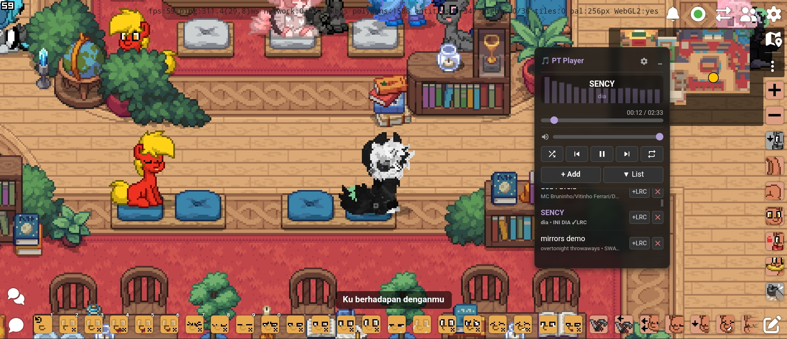

# PT Local Music Player

[](https://www.tampermonkey.net/)
[](https://github.com/deitzu/ponytown-local-music-player/releases)
[](LICENSE)
[](https://github.com/deitzu/ponytown-local-music-player/stargazers)
[](https://github.com/deitzu/ponytown-local-music-player)



A feature-rich, self-contained music player userscript for [Pony Town](https://pony.town). Built as a Tampermonkey script with zero external dependencies. Draggable, themeable, with native ID3 parsing, real-time synchronized lyrics, and an audio visualizer.

---

## Table of Contents

- [Features](#features)
- [Installation](#installation)
- [Usage](#usage)
- [Configuration](#configuration)
- [Changelog](#changelog)
- [Technical Details](#technical-details)
- [License](#license)

---

## Features

### Core Playback
- Persistent playlist — Tracks stored in IndexedDB (survives browser restarts)
- Native ID3v2 parser — Reads title, artist, album from MP3 headers (v2.3/v2.4) without external libraries
- Web Audio API — Precise volume control via GainNode
- Media Session API — Hardware media keys, lock screen controls, Bluetooth headset support

### Audio Visualization
- Canvas-based frequency bars using Web Audio API analyser
- Four color themes (Amber, Emerald, Cyan, Violet)

### Lyrics Support
- LRC parsing — Timestamped lyrics ([mm:ss.xx]) with real-time synchronization
- Per-track lyric offset — Fine-tune timing in 0.1s increments
- Three display modes: Overlay (floating), Embedded (in-player), Off
- Three visual styles: YouTube-style, Glow outline, Glassmorphism
- Auto-fetch — Queries lrclib.net for missing synced lyrics
- Manual .lrc upload — Attach lyrics per-track via the playlist

### Playback Controls
- Play / Pause / Previous / Next
- Shuffle mode
- Repeat modes: Off → All → One (three-state toggle)
- Seek bar with time display
- Volume slider

### UI/UX
- Draggable window — Click and drag the header to reposition
- Marquee scrolling — Long track titles scroll automatically
- Minimize mode — Collapses to compact bar showing current track
- Scrollable settings panel — All options in one place
- Toast notifications — Slide-in notifications with progress bar
- Idle fade — Auto-dims after configurable timeout
- Persistent position — Remembers window location via localStorage
- Input blocking — Prevents Pony Town keybinds from interfering

---

## Installation

1. Install [Tampermonkey](https://www.tampermonkey.net/) (or Violentmonkey/Greasemonkey)
2. Copy `userscript.js` contents into a new userscript
3. Visit [pony.town](https://pony.town/) — the player appears in the top-right

---

## Usage

| Action | How |
|--------|-----|
| Add music | Click `+ Add` → select audio files (MP3, OGG, etc.) |
| Play track | Click a track in the list, or use Prev/Next/Play buttons |
| Attach lyrics | Click `+LRC` on a track → select `.lrc` file |
| Adjust offset | Overlay: `±` buttons during playback; Settings: numeric editor |
| Move player | Drag the header bar (anywhere except buttons) |
| Minimize | Click `_` button |
| Settings | Click gear icon |
| Clear all | Settings → Danger: Clear All Tracks (irreversible) |

---

## Configuration

All settings persist in `localStorage` under key `pt_mp_settings`:

| Setting | Options | Default |
|---------|---------|---------|
| Theme | Amber / Emerald / Cyan / Violet | Amber |
| Lrc Mode | Off / Overlay / Embedded | Overlay |
| Lrc Style | YouTube / Glow / Glass | YouTube |
| Lrc Pos (Y) | 5–50% (overlay vertical offset) | 20% |
| Font Size | 12–24px | 16px |
| Idle Fade (s) | 2–10s (auto-dim delay) | 3.5s |
| Idle Opacity | 0.1–1.0 (dimmed opacity) | 0.3 |
| Auto-Fetch API | On / Off | On |
| Audio Visualizer | On / Off | On |
| Quick LRC Offset | On / Off | On |
| Toast Notification | On / Off | On |

---

## Changelog

### v1.9.3 — Toast Notification Overhaul
*Sep 6, 2026*

**New Features:**
- Redesigned toast with track title, artist, duration, and progress bar
- Progress bar animation depletes over the 3-second toast lifetime
- Smooth slide-in/out animation using `cubic-bezier(0.18, 0.89, 0.32, 1.28)`
- Toast setting toggle in settings panel
- Metadata-aware triggering (fires on `audio.onloadedmetadata`)

**Improvements:**
- Hoisted `formatTime()` to top-level for reuse in toast display
- Removed inline comments for cleaner code

**Removed:**
- Temporary patch files

---

### v1.9.2 — Gemini Patch Integration
*Sep 5, 2026*

**New Features:**
- Audio Visualizer — Canvas-based frequency bars via Web Audio analyser
- Themes — Four color schemes (Amber, Emerald, Cyan, Violet) via CSS custom properties
- Marquee scrolling — Long track titles scroll automatically (6s loop)
- Quick LRC Offset panel — Overlay `±` buttons for instant lyric timing
- Idle fade settings — Configurable timeout (2–10s) and opacity (0.1–1.0)
- Scrollable settings panel — `max-height: 250px` with vertical overflow

**Bug Fixes:**
- Lyric background auto-hide: empty containers now hidden when no lyrics
- Offset direction fixed: `parseLRC()` uses `+offset` for correct delay direction

---

### v1.9.1 — Lyric Offset Feature
*Sep 5, 2026*

**New Features:**
- Per-track lyric offset — `lrcOffset` field in IndexedDB per-track
- DB Version 2 — Migration with `onupgradeneeded` handler
- Numeric `+/–` input in settings for lyric timing adjustment
- Offset persists per-track across sessions

---

### v1.8.1 — Initial Release
*Sep 4, 2026*

Core features: IndexedDB playlist, ID3 parsing, LRC lyrics, shuffle/repeat, draggable window, settings panel.

---

## Technical Details

### Storage Schema (IndexedDB)
```
DB: PT_MusicPlayer_DB (v2)
Store: playlist (autoIncrement id)
Record: {
  id: number,
  name: string,      // ID3 TIT2 or filename
  artist: string,    // ID3 TPE1
  album: string,     // ID3 TALB
  blob: Blob,        // original audio file
  lyrics: string,    // LRC text (optional)
  lrcOffset: number  // lyric timing offset in seconds (default 0)
}
```

### ID3 Parser Limitations
- Reads only first 128 KB of file (covers most ID3v2 tags)
- Supports ID3v2.3 (ISO-8859-1/UTF-16) and v2.4 (UTF-8)
- Frames parsed: TIT2 (title), TPE1 (artist), TALB (album)
- Falls back to filename if no tags found

### Browser APIs Used
- indexedDB — persistent storage (v2 schema with migration)
- FileReader + DataView — binary ID3 parsing
- Audio + AudioContext — playback, volume, visualizer
- navigator.mediaSession — system media controls
- fetch — lrclib.net lyrics API
- localStorage — settings and window position

### Icons
All icons are inline SVGs defined directly in the script (public domain / MIT), no external icon library required.

---

## File Structure
```
userscript.js   # Single-file userscript (~600 lines)
README.md       # This file
LICENSE         # MIT License
```

---

## License

MIT — free to use, modify, distribute.

## Credits

- Author: [deitzu](https://github.com/deitzu)
- Lyrics API: [lrclib.net](https://lrclib.net)
- Icons: Inline SVGs (public domain / MIT)
