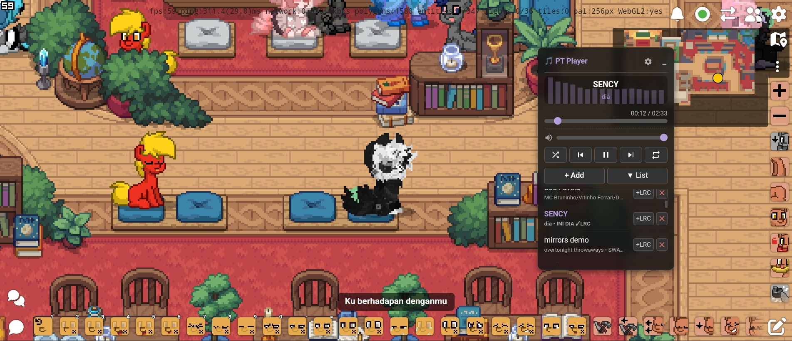

# PT Local Music Player

[](https://www.tampermonkey.net/)
[](userscript.js)
[](android/README.md)
[](LICENSE)
[](https://github.com/deitzu/ponytown-local-music-player/stargazers)
[](userscript.js)



A feature-rich, self-contained local music player for [Pony Town](https://pony.town), shipped as a Tampermonkey userscript with zero external dependencies. Draggable, themeable, with native ID3 parsing, tags, real-time synchronized lyrics (with romanization and translation), and an audio visualizer.

This repository also contains a standalone **native Android rebuild** of the player. See [Native Android app](#native-android-app).

> The screenshot above predates the 2.x theme engine, so the UI colors differ slightly from the current version.

---

## Table of Contents

- [Features](#features)
- [Installation](#installation)
- [Usage](#usage)
- [Configuration](#configuration)
- [Native Android app](#native-android-app)
- [Changelog](#changelog)
- [Technical Details](#technical-details)
- [File Structure](#file-structure)
- [License](#license)

---

## Features

### Core Playback
- Persistent playlist — Tracks stored in IndexedDB (survives browser restarts)
- Native ID3v2 parser — Reads title, artist, album, genre from MP3 headers (v2.3/v2.4) without external libraries
- Web Audio API — Precise volume control via GainNode
- Media Session API — Hardware media keys, lock screen controls, Bluetooth headset support

### Tags
- Multiple tags per track, editable from the playlist
- Auto-Tag — Seeds tags from the ID3 genre when tracks are added
- Tag filter with Match-ALL logic — Select several tags and only tracks having all of them are shown (or pick `Untagged` to see tracks without tags)
- Playback pool follows the active filter (next / previous / shuffle stay inside the filtered list)

### Lyrics
- LRC parsing — Timestamped lyrics (`[mm:ss.xx]`) with real-time synchronization
- Per-track lyric offset — Fine-tune timing in 0.1s increments
- Auto-fetch — Queries lrclib.net for missing synced lyrics, with optional Auto-Select (first match)
- Manual lyric search and `.lrc` upload — Pick a candidate or attach a file per track
- Romanization and translation — Non-Latin lyrics (Japanese, Korean, Chinese, Cyrillic, Devanagari, Arabic, and more) get a romanized line and a translated line under the original
- Independent toggles for Original / Romaji / Translation, plus a dedicated subtitle size
- Three display modes: Overlay (floating), Embedded (in-player), Off
- Three visual styles: YouTube-style, Glow outline, Glassmorphism

### Audio Visualization
- Canvas-based frequency bars using the Web Audio analyser, colored by the active theme

### Themes
- Five themes: Tokyo Night, Espresso, Dracula, Nord, Catppuccin Mocha

### Playback Controls
- Play / Pause / Previous / Next
- Shuffle mode
- Repeat modes: Off → All → One (three-state toggle)
- Seek bar with time display
- Volume slider

### UI/UX
- Draggable window — Click and drag the header to reposition
- Marquee scrolling — Long track titles scroll automatically
- Minimize mode — Collapses to a compact bar showing the current track
- Scrollable settings panel — All options in one place
- Toast notifications — Slide-in notification with title, artist, duration, and progress bar
- Idle fade — Auto-dims after a configurable timeout
- Persistent position — Remembers window location via localStorage
- Input blocking — Prevents Pony Town keybinds from interfering

---

## Installation

1. Install [Tampermonkey](https://www.tampermonkey.net/) (or Violentmonkey/Greasemonkey)
2. Copy the contents of [`userscript.js`](userscript.js) into a new userscript
3. Visit [pony.town](https://pony.town/) — the player appears in the top-right

---

## Usage

| Action | How |
|--------|-----|
| Add music | Click `+ Add` → select audio files (MP3, OGG, etc.) |
| Play track | Click a track in the list, or use Prev/Next/Play buttons |
| Filter by tag | Open the list → `Filter` → `+ Add Tag` (select several for Match-ALL) |
| Attach lyrics | Click `+LRC` on a track → search LRCLIB or select a `.lrc` file |
| Adjust offset | Overlay: `±` buttons during playback; Settings: numeric editor |
| Move player | Drag the header bar (anywhere except buttons) |
| Minimize | Click `_` button |
| Settings | Click gear icon |
| Clear all | Settings → Danger: Clear All Tracks (irreversible) |

---

## Configuration

All settings persist in `localStorage` under key `pt_mp_settings`:

| Setting | Options | Default |
|---------|---------|---------|
| Theme | Tokyo Night / Espresso / Dracula / Nord / Catppuccin Mocha | Tokyo Night |
| Lrc Mode | Off / Overlay / Embedded | Overlay |
| Lrc Style | YouTube / Glow / Glass | YouTube |
| Ori / Romaji / Trans | On / Off each | On |
| Sub Size | 10–20px (romanization/translation lines) | 13px |
| Lrc Pos (Y) | 5–50% (overlay vertical offset) | 20% |
| Font Size | 12–24px | 16px |
| Idle Fade (s) | 2–10s (auto-dim delay) | 3.5s |
| Idle Opacity | 0.1–1.0 (dimmed opacity) | 0.3 |
| Auto-Fetch API | On / Off | On |
| Auto-Select (1st Match) | On / Off | On |
| Auto-Tag (ID3) | On / Off | On |
| Audio Visualizer | On / Off | On |
| Quick LRC Offset | On / Off | On |
| Toast Notification | On / Off | On |

Window position is stored under `pt_mp_pos`.

---

## Native Android app

The [`android/`](android) directory holds a standalone native rebuild (Kotlin, Jetpack Compose, Media3). It does not need the userscript or Pony Town.

- Local library via MediaStore and the document picker, with tags, search, and tag filters
- Background playback through a Media3 session service
- LRCLIB lyrics with LRC overlay modes and per-track offset
- Draggable floating player with lyric overlay (needs overlay permission)
- Debug APKs are built by GitHub Actions (`Build Android APK`) and uploaded as the `pt-local-music-player-debug` artifact

Full details, permissions, and build notes: [`android/README.md`](android/README.md).

---

## Changelog

### v2.3.2 — Reliable Romanization
*Oct 5, 2026*

**Bug Fixes:**
- Rewrote romanization response parsing (supports the `sentences[].src_translit` shape and the legacy array shape)
- Romanization cache is now validated; entries that just echo the original script are discarded and refetched
- Language is detected per line (Japanese, Korean, Chinese, Cyrillic variants, Indic scripts, Arabic, Burmese, Amharic) instead of assuming one language
- Fixed over-escaped regular expressions (`\\u3040`, `\\x00`, `\\n`) that broke language detection and LRC line splitting

**Improvements:**
- Relaxed UI button borders
- Tightened the YouTube-style lyric background

**Repository:**
- `userscript.js` is now the single source of the userscript (the versioned `.txt` copy was removed)

---

### v2.3.1 — Theme Engine and Batch Romanization
*Oct 3, 2026*

- Theme engine with five themes (Tokyo Night, Espresso, Dracula, Nord, Catppuccin Mocha)
- Romanization and translation of non-Latin lyrics, stored per track
- Original / Romaji / Translation toggles and subtitle size setting
- Auto-Select (first match) for LRCLIB results

---

### v1.9.5 — Multiple Tags and Match-ALL Filter
*Sep 7, 2026*

- Multiple tags per track
- Match-ALL tag filter

### v1.9.4 — Tag System
*Sep 6, 2026*

- Tag system with Auto-Tag from ID3 genre
- Tag-based playback pool

---

### v1.9.3 — Toast Notification Overhaul
*Sep 6, 2026*

- Redesigned toast with track title, artist, duration, and progress bar
- Smooth slide-in/out animation, toggle in settings
- Metadata-aware triggering (fires on `audio.onloadedmetadata`)

### v1.9.2 — Gemini Patch Integration
*Sep 5, 2026*

- Audio visualizer, themes, marquee titles, Quick LRC Offset panel, idle fade settings, scrollable settings panel
- Fixed lyric background auto-hide and offset direction

### v1.9.1 — Lyric Offset Feature
*Sep 5, 2026*

- Per-track lyric offset stored in IndexedDB (DB version 2 migration)
- Numeric `+/–` input in settings

### v1.8.1 — Initial Release
*Sep 4, 2026*

Core features: IndexedDB playlist, ID3 parsing, LRC lyrics, shuffle/repeat, draggable window, settings panel.

---

## Technical Details

### Storage Schema (IndexedDB)
```
DB: PT_MusicPlayer_DB (v2)
Store: playlist (autoIncrement id)
Record: {
  id: number,
  name: string,              // ID3 TIT2 or filename
  artist: string,            // ID3 TPE1
  album: string,             // ID3 TALB
  blob: Blob,                // original audio file
  lyrics: string,            // LRC text (optional)
  romanizedLyrics: string,   // romanized LRC text (generated)
  translatedLyrics: string,  // translated LRC text (generated)
  lrcOffset: number,         // lyric timing offset in seconds (default 0)
  tags: string[]             // user tags (seeded from ID3 genre when Auto-Tag is on)
}
```

### ID3 Parser Limitations
- Reads only the first 128 KB of the file (covers most ID3v2 tags)
- Supports ID3v2.3 (ISO-8859-1/UTF-16) and v2.4 (UTF-8)
- Frames parsed: title, artist, album, genre
- Falls back to the filename if no tags are found

### Network Requests
The userscript talks to two external services, both optional:
- `lrclib.net` — lyric lookup and search (Auto-Fetch)
- `translate.googleapis.com` — romanization and translation of non-Latin lyric lines (lyric text is sent to this endpoint)

### Browser APIs Used
- indexedDB — persistent storage (v2 schema with migration)
- FileReader + DataView — binary ID3 parsing
- Audio + AudioContext — playback, volume, visualizer
- navigator.mediaSession — system media controls
- fetch — lyric and romanization APIs
- localStorage — settings and window position

### Icons
All icons are inline SVGs defined directly in the script (public domain / MIT), no external icon library required.

---

## File Structure
```
userscript.js            # Pony Town userscript (v2.3.2, single file)
android/                 # Native Android app (Kotlin + Compose + Media3)
.github/workflows/       # CI: builds the Android debug APK
README.md                # This file
LICENSE                  # MIT License
```

---

## License

MIT — free to use, modify, distribute.

## Credits

- Author: [deitzu](https://github.com/deitzu)
- Lyrics API: [lrclib.net](https://lrclib.net)
- Icons: Inline SVGs (public domain / MIT)
